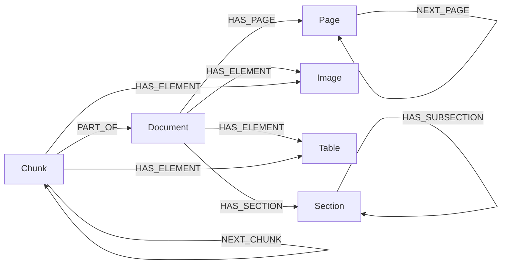

# mcp-neo4j-lexical-graph

MCP server for creating rich lexical graphs from PDF documents in Neo4j. Designed for Neo4j sales engineers to quickly build PDF-to-graph and GraphRAG agent chatbot POCs.

Supports four parsing strategies (PyMuPDF, Docling, page-image, VLM block ordering), pluggable chunking, document versioning, VLM-based description generation, and vector/fulltext search with Neo4j 2026.01 native VECTOR type and document-name prefiltering.

## Graph Model



Node types depend on the parse mode used. See [Parse Modes](#parse-modes) below.

## Parse Modes

| Mode | Nodes created | Best for |
|------|--------------|----------|
| `pymupdf` | Document, Chunk, Image, Table | General-purpose text + visual extraction |
| `docling` | Document, Page, Element, Section, (then Chunk via chunking tool) | Complex layouts, section-aware chunking |
| `page_image` | Document, Page | Slides/presentations for VLM-based extraction |
| `vlm_blocks` | Document, Page, Element, Section, (then Chunk via chunking tool) | Complex layouts without docling dependency (uses VLM API) |

## Quick Start

```bash
cd mcp-neo4j-lexical-graph
uv sync                        # pymupdf + page_image modes
uv sync --extra docling        # add docling support
```

### Cursor MCP Configuration

Add to your `.cursor/mcp.json`:

```json
{
  "mcpServers": {
    "neo4j-lexical-graph": {
      "command": "uv",
      "args": [
        "--directory",
        "/path/to/mcp-neo4j-lexical-graph",
        "run",
        "mcp-neo4j-lexical-graph"
      ],
      "env": {
        "NEO4J_URI": "bolt://localhost:7687",
        "NEO4J_USERNAME": "neo4j",
        "NEO4J_PASSWORD": "your-password",
        "NEO4J_DATABASE": "neo4j",
        "EMBEDDING_MODEL": "text-embedding-3-small",
        "EXTRACTION_MODEL": "gpt-5-mini",
        "OPENAI_API_KEY": "sk-..."
      }
    }
  }
}
```

## Tools

| Tool | Description | Docs |
|------|-------------|------|
| `create_lexical_graph` | Parse PDF(s) and create the graph (async, returns job_id) | [Graph Creation](docs/tools-graph-creation.md) |
| `check_processing_status` | Monitor background job progress | [Graph Creation](docs/tools-graph-creation.md) |
| `cancel_job` | Cancel a running background job | [Graph Creation](docs/tools-graph-creation.md) |
| `chunk_lexical_graph` | Create Chunk nodes from Elements (4 strategies) | [Chunking](docs/tools-chunking.md) |
| `embed_chunks` | Add vector embeddings + create indexes | [Embedding](docs/tools-embedding.md) |
| `verify_lexical_graph` | Structural checks + Markdown reconstruction | [Verification](docs/tools-verification.md) |
| `list_documents` | Inventory of documents with version info | [Version Management](docs/tools-version-management.md) |
| `delete_document` | Remove a document version with cascade | [Version Management](docs/tools-version-management.md) |
| `set_active_version` | Activate a specific document/chunk version | [Version Management](docs/tools-version-management.md) |
| `clean_inactive` | Delete inactive versions | [Version Management](docs/tools-version-management.md) |
| `assign_section_hierarchy` | LLM-based section level assignment + heading chains | [Post-processing](docs/tools-postprocessing.md) |
| `generate_chunk_descriptions` | VLM descriptions for images/tables/pages | [Post-processing](docs/tools-postprocessing.md) |

## Environment Variables

| Variable | Required | Default | Description |
|----------|----------|---------|-------------|
| `NEO4J_URI` | Yes | `bolt://localhost:7687` | Neo4j connection URI |
| `NEO4J_USERNAME` | Yes | `neo4j` | Neo4j username |
| `NEO4J_PASSWORD` | Yes | - | Neo4j password |
| `NEO4J_DATABASE` | No | `neo4j` | Database name |
| `EMBEDDING_MODEL` | No | `text-embedding-3-small` | Default embedding model ([LiteLLM providers](https://docs.litellm.ai/docs/embedding/supported_embedding)) |
| `EXTRACTION_MODEL` | No | `gpt-5-mini` | LLM/VLM for section hierarchy and description generation |
| `OPENAI_API_KEY` | Depends | - | Required when using OpenAI models for embedding or extraction. Other providers use their own key (e.g. `ANTHROPIC_API_KEY`, `AZURE_API_KEY`). See [LiteLLM docs](https://docs.litellm.ai/docs/providers) |

## Requirements

- **Neo4j 2026.01+** (native VECTOR type, vector search with filters)
- **Python 3.10+**
- API key for your embedding provider (OpenAI, Azure, Cohere, Voyage, Ollama, etc.)
- API key for VLM if using `vlm_blocks` mode, `generate_chunk_descriptions`, or `assign_section_hierarchy`
